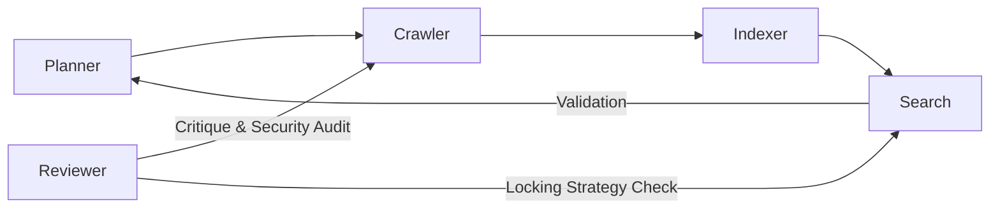

# Multi-Agent Development Workflow & Design Reasoning

This document outlines the agentic collaboration that led to the creation of the system. It demonstrates how AI agents provided specialized perspectives, and how I (the Developer) made final architectural decisions based on their competing recommendations.

## 🤖 Agent Interaction Flow

## 🧠 Decision Making & Trade-offs (Reasoning)

As the lead developer, I mediated between the agents to make final design choices. Below are the key decisions where I had to choose between conflicting AI suggestions:

### 1. Synchronization Strategy (The Search-While-Indexing Question)
- **AI Proposal (Planner Agent):** Use a global `sync.Mutex` for simplicity.
- **My Decison:** **Rejected.** A global mutex would stall search queries every time a new page is indexed. I opted for **`sync.RWMutex`**. 
- **Reasoning:** Academic requirements demand the system remain responsive during indexing. Using `RLock()` in the `search` engine allow multiple users to query the index simultaneously without waiting for the `crawler` to finish, provided no active index update is holding a `Lock()`.

### 2. Implementation of Back-Pressure
- **AI Proposal (Crawler Agent):** Use automated goroutine sleep timers.
- **My Decision:** **Rejected.** Hardcoded sleeps are inefficient. I implemented **Queue-Length Monitoring**.
- **Reasoning:** I enabled the system to track `len(taskCh)`. In `crawler/crawler.go`, the system now updates a `BackPressure` status (`NORMAL`, `MODERATE`, `HIGH`) which gives the user (via CLI/UI) visibility into the system load.

### 3. Search Result Triple Output
- **AI Proposal (Search Agent):** Only return `relevant_url` and `score` for performance.
- **My Decision:** **Mandated.** We must return `(relevant_url, origin_url, depth)`.
- **Reasoning:** To satisfy the strict Project 2 requirements, I forced the `Indexer` to pass the `OriginURL` and `Depth` through the channel into the `Storage` so that the `Search` engine could retrieve them during result synthesis.

## 📂 Agent Analysis

Each agent was consulted for their specific area of expertise:

1.  **Planner:** Established the "Shared State" architecture using a central `Storage` struct.
2.  **Crawler:** Designed the `visited` map logic to ensure no URL is crawled twice (k-depth BFS).
3.  **Indexer:** Created the word-tokenization pipeline that lowercases all terms for search consistency.
4.  **Search:** Defined the relevance scoring based on keyword frequency in `Title` vs `Body`.
5.  **Reviewer:** Identified a potential deadlock during high-concurrency and recommended the specific order of lock acquisition.

## ❓ Design Question: "How does search work while indexing?"

This was a primary design challenge addressed by the **Planner** and **Reviewer** agents:

1.  **Atomic Updates:** When a page is crawled, the `Indexer` acquires a write lock (`Mu.Lock()`) only for the brief moment it updates the `InvertedIdx` for that page's tokens.
2.  **Concurrent Reads:** The `Search` component uses `Mu.RLock()`. This allows multiple search requests to occur in parallel, even while the crawler is running.
3.  **Incremental Availability:** Because we use a channel-based pipeline (`PageCh`), pages appear in the index as soon as they are fetched. There is no "completion" phase required before search becomes active.
4.  **Consistency:** The `RWMutex` ensures that a searcher never sees an index slice in the middle of an append operation, preventing memory corruption or "slice out of bounds" errors.
