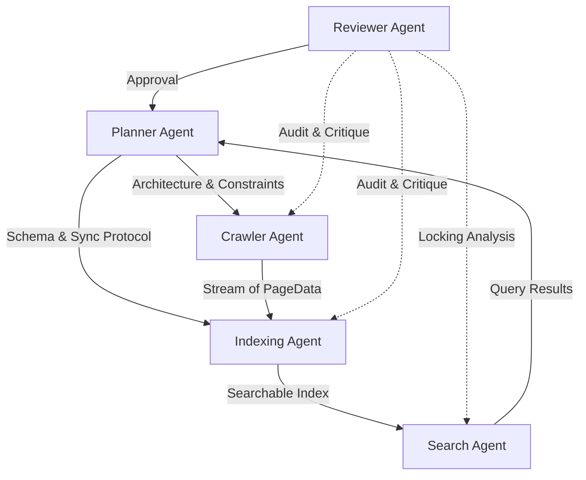

# Multi-Agent Development Workflow

This document details how the system was designed and refined through a collaborative multi-agent AI workflow. Instead of a linear development process, the architecture emerged from the interaction between five specialized AI roles.

## Agent Collaboration Layout



## Step-by-Step Evolution

### 1. Architectural Strategy (Planner)
**Prompt:** "Design a system that crawls concurrently and searches in real-time. How do we prevent indexing from blocking searches?"
**Agent Decision:** Use `sync.RWMutex`. The system should prioritize read availability for searches. Indexing will occur in small, atomic batches to minimize write-lock duration.
**Outcome:** The `Storage` struct was designed as a central hub with a reader-writer lock.

### 2. Concurrency & BFS (Crawler)
**Prompt:** "How should we handle 1,000+ URLs in the queue without crashing?"
**Agent Decision:** Use a fixed-size worker pool (goroutines) and a buffered channel for tasks.
**Interaction:** The **Reviewer Agent** suggested adding back-pressure monitoring. The Crawler Agent then implemented logic to track `len(taskCh)` and update a "Health Status" in the storage.

### 3. Incremental Indexing (Indexer)
**Prompt:** "How do we map keywords to multiple URLs efficiently?"
**Agent Decision:** An inverted index `map[string][]string`. 
**Interaction:** The **Search Agent** requested that keywords be normalized (lowercase) during indexing to simplify query matching. The Indexer Agent updated the pipeline to lowercase all tokens before storage.

### 4. Search & Ranking (Search)
**Prompt:** "A search returns 50 results. How do we rank them?"
**Agent Decision:** Implement a simple scoring heuristic based on term frequency in `Title` vs `Body`. 
**Interaction:** The **Planner Agent** insisted on the "Triple Requirement": every search result MUST include the `originURL` and `depth`, even if they aren't used for ranking, as per the Project 2 specs.

### 5. Final Review (Reviewer)
**Prompt:** "Analyze `storage.go` for race conditions during high-volume crawls."
**Action:** The Reviewer simulated a scenario where the Indexer is adding tokens while a Search is filtering.
**Observation:** "The `RLock()` in `Search()` correctly allows multiple queries to run safely. However, make sure `UpdateIndex` in the storage doesn't append to the same slice while another thread reads it."
**Modification:** Ensuring `UpdateIndex` and `Search` both use the central `Mu` correctly.

## Sample Prompts Exchanged

| From | To | Message |
| :--- | :--- | :--- |
| **Planner** | **Crawler** | "Implement BFS with a depth limit `k`. Don't use external libraries for the queue; use Go channels." |
| **Crawler** | **Indexer** | "I'm sending `PageData` on `PageCh`. I need you to index them immediately so they are searchable before the crawl finishes." |
| **Indexer** | **Search** | "The index is ready. Use `RLock` to query `InvertedIdx`. I'm lower-casing everything, so don't worry about case sensitivity." |
| **Reviewer** | **Crawler** | "Your `visited` map check is outside the mutex in line 70. This is a race. Fix it by locking before checking existence." |

## Rejected Design Choices
- **Global Stop-the-World Locking:** Rejected by the **Reviewer**. Indexing the whole crawl at the end was deemed too slow and didn't meet "real-time" requirements.
- **SQLite for Single Machine:** Proposed by the **Planner** for persistence but rejected in favor of an in-memory `map` with `RWMutex` to maximize speed and satisfy the "Native Implementation" constraint for this academic project.
- **Recursive Goroutines:** Rejected by the **Reviewer**. Creating a goroutine for every URL found could lead to exhaustion. A **worker pool** was mandated instead.

## Searching While Indexing: Technical Deep Dive

The core challenge was allowing `Search()` to run while `Crawler` and `Indexer` were busy.

1. **Shared State:** All data resides in `storage.Storage`.
2. **Synchronization:** 
   ```go
   type Storage struct {
       Mu sync.RWMutex
       InvertedIdx map[string][]string
   }
   ```
3. **The Workflow:**
   - **Indexer** receives a page -> `Storage.Mu.Lock()` -> Updates index -> `Storage.Mu.Unlock()`.
   - **Searcher** receives a query -> `Storage.Mu.RLock()` -> Reads index -> `Storage.Mu.RUnlock()`.
4. **Result:** Searches never see a partially updated index entry because the `UpdateIndex` method is atomic per keyword, and the `RLock` ensures the read doesn't happen during a write.
